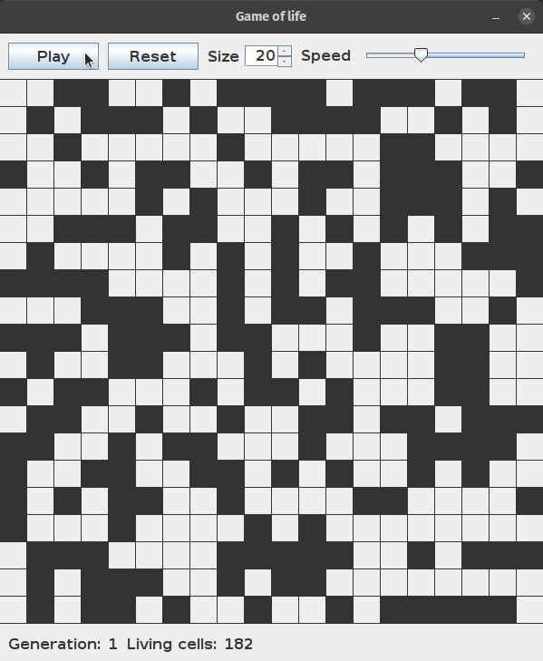

<h1>Game of Life</h1>

Java GUI implentation of [Conway's Game of Life](https://en.wikipedia.org/wiki/Conway%27s_Game_of_Life) with the capacity of reset the random seed of the universe, change its size from 10 to 30 and increase/decrease generation speed.

Rules:

- Any live cell with fewer than two live neighbours dies, as if by underpopulation.
- Any live cell with two or three live neighbours lives on to the next generation.
- Any live cell with more than three live neighbours dies, as if by overpopulation.
- Any dead cell with exactly three live neighbours becomes a live cell, as if by reproduction.

